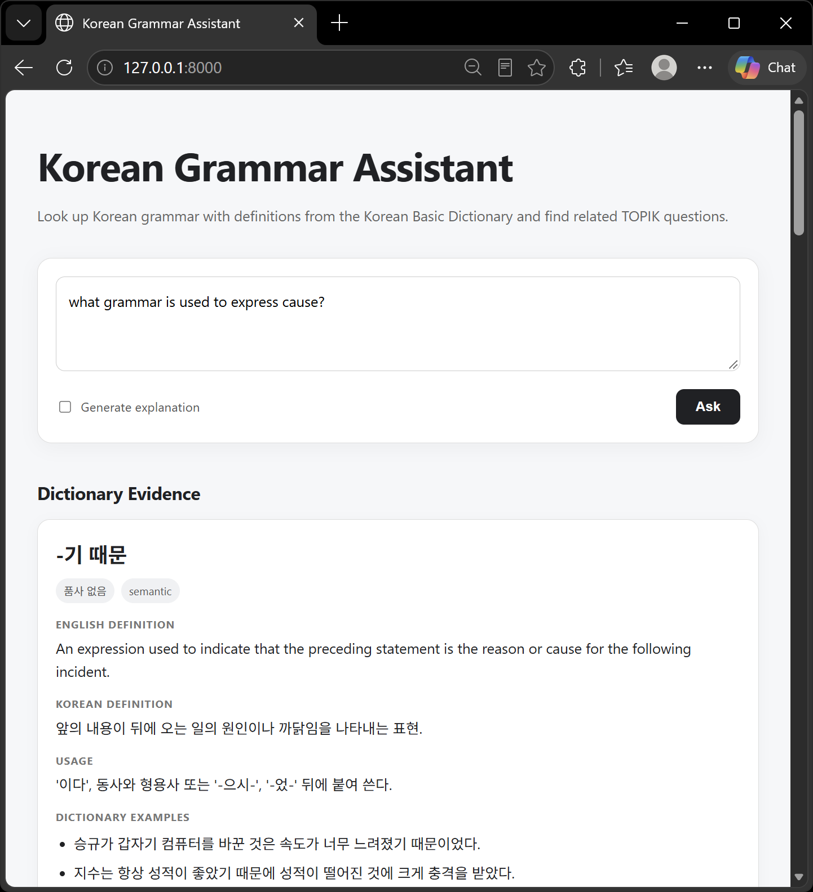
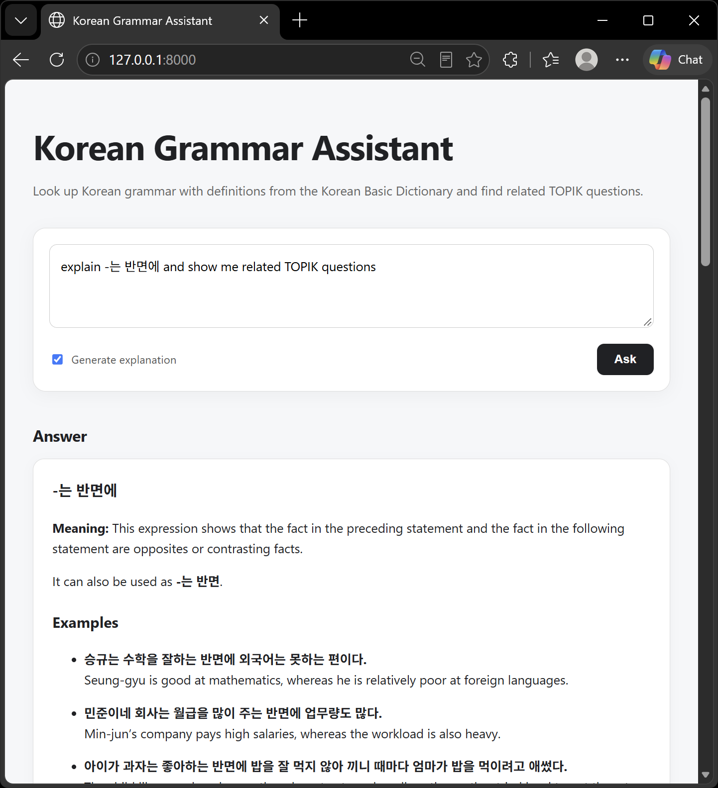
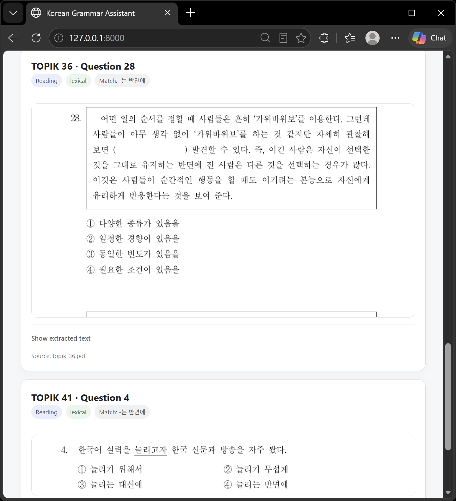
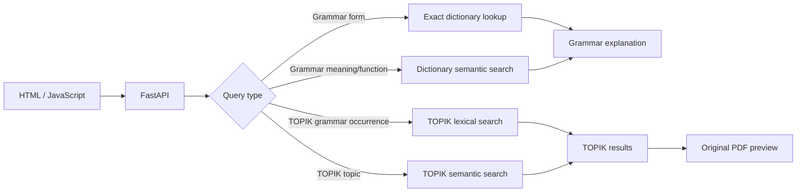

# Korean Grammar RAG

A small RAG project for looking up Korean grammar and finding related TOPIK reading questions.

Grammar explanations are based on the Korean Basic Dictionary. TOPIK papers are kept separate and are used only to show where a grammar form or topic appears in an actual exam.

## Demo

[Watch the short demo](docs/demo/korean_grammar_rag_demo.mp4)

### Grammar search

Open-ended queries can retrieve grammar forms by meaning or function.



### Grammar explanation

The app can generate an explanation from retrieved dictionary entries and examples.



### TOPIK retrieval

Grammar forms can also be searched across TOPIK reading papers. Matching questions are shown directly from the original PDF.



## What it does

- Looks up a specific Korean grammar form.
- Searches for grammar by meaning or communicative function, for example cause, contrast, uncertainty, or intention.
- Accepts queries in Korean or English.
- Uses multilingual embeddings for semantic search.
- Searches TOPIK papers for literal grammar occurrences and related topics.
- Shows the original TOPIK question as a PDF crop.
- Keeps dictionary explanations and TOPIK exam evidence separate.
- Returns no answer when the available sources are not sufficient.

## How it works



The dictionary and TOPIK data use separate Chroma collections.

`intfloat/multilingual-e5-small` is used for embeddings and runs locally on CPU. Explicit grammar forms use exact lookup where possible, while open-ended grammar and TOPIK topic queries use semantic retrieval.

TOPIK occurrence searches use normalized lexical matching when the user provides a specific grammar form.

## TOPIK processing

TOPIK papers are processed before they are added to the search index.

The pipeline:

1. extracts the configured reading pages;
2. uses the PDF text layer when it is usable;
3. falls back to EasyOCR for scanned or fragmented PDFs;
4. identifies question and instruction boundaries;
5. creates one retrieval unit per question;
6. keeps shared passages separate from individual questions;
7. builds the TOPIK Chroma index;
8. stores crop coordinates for the original PDF;
9. validates question coverage and preview metadata.

The app does not store permanent screenshots of every question. PDF crops are generated when requested.

Shared questions can have more than one crop: for example, one for the shared passage and another for the selected question.

## Tech stack

- Python
- FastAPI
- LangChain
- OpenAI API
- Chroma
- `intfloat/multilingual-e5-small`
- PyMuPDF
- EasyOCR
- HTML / JavaScript

## Setup

Python 3.11 or newer is recommended.

```powershell
python -m venv .venv
.\.venv\Scripts\Activate.ps1
python -m pip install -r requirements.txt
Copy-Item .env.example .env
```

Add your OpenAI API key to `.env`:

```text
OPENAI_API_KEY=your_api_key_here
```

`OPENAI_MODEL` can also be set in `.env` if needed.

The embedding model is downloaded automatically the first time it is used.

## Preparing the data

Raw dictionary exports, TOPIK PDFs, OCR model weights, and generated indexes are not included in this repository.

See [data/README.md](data/README.md) for the expected local directory structure and [DATA_NOTICE.md](DATA_NOTICE.md) for source and redistribution notes.

### Korean Basic Dictionary

The full Korean Basic Dictionary can be downloaded from the official dictionary website:

[한국어기초사전 - 사전 전체 내려받기](https://krdict.korean.go.kr/download/downloadPopup)

Download the JSON exports and place them in:

```text
data/raw/
```

Then run:

```powershell
python scripts/extract_grammar.py
python scripts/clean_grammar.py
python scripts/build_chroma.py
```

This creates the cleaned grammar records and the local dictionary Chroma index.

### TOPIK papers

Past TOPIK papers can be downloaded from the official TOPIK study-materials page:

[TOPIK 한국어능력시험 - 학습 자료실](https://www.topik.go.kr/TWSTDY/TWSTDY0100.do)

Place the downloaded PDFs in:

```text
data/topik/raw/
```

The file:

```text
data/topik/sources.json
```

contains metadata for the papers used by the preprocessing pipeline:

- exam number;
- local PDF filename;
- inclusive PDF-page range containing the reading section;
- extraction mode.

The page range refers to PDF pages, not TOPIK question numbers. It is needed because the downloaded files can contain cover pages or other material outside the reading section.

A manifest entry looks like:

```json
{
  "exam_number": 64,
  "file": "topik_64.pdf",
  "reading_pages": [5, 25],
  "extraction": "auto",
  "enabled": true
}
```

The PDF itself is not included in this repository.

For an exam already listed in `sources.json`:

```powershell
python -m scripts.prepare_topik --exam 64
```

To add a new paper:

```powershell
python -m scripts.prepare_topik --exam 83 --file topik_83.pdf --reading-pages 5 25
```

`extraction` controls how text is read from the PDF. `auto` uses the embedded text layer when it is usable and falls back to EasyOCR otherwise; `native` forces embedded PDF text, and `ocr` forces EasyOCR.

If the reading section is on different pages in another PDF edition, use the page range from your local copy.

To validate existing processed data without rebuilding it:

```powershell
python -m scripts.prepare_topik --exam 83 --validate-only
```

The command returns a non-zero exit code if the question set or preview metadata fails validation.

### OCR models

OCR is handled by EasyOCR.

The OCR weight files are not included in this repository. On the first OCR run, EasyOCR can download the required Korean and English models automatically.

The project stores local OCR models under:

```text
data/topik/ocr_models/
```

and OCR cache files under:

```text
data/topik/processed/ocr_cache/
```

Both are ignored by Git.

If the TOPIK PDF has a usable native text layer, OCR is not used.

## Running the app

```powershell
uvicorn app.main:app --reload
```

Then open:

```text
http://127.0.0.1:8000
```

Main endpoints:

- `GET /`
- `GET /health`
- `POST /ask`
- `GET /topik/preview/{exam_number}/{question_start}/{question_end}`

## Example queries

```text
What does -은 듯 mean?
```

```text
What grammar expresses cause?
```

```text
What grammar expresses uncertainty?
```

```text
Explain -는 반면에 and show me related TOPIK questions.
```

```text
Show me TOPIK occurrences of -는 반면에.
```

```text
Find TOPIK questions about environmental pollution.
```

## Evaluation

Run:

```powershell
python -m unittest discover -s tests -v
python -m scripts.evaluate_retrieval
python -m scripts.validate_topik_question_mapping
```

The TOPIK parser was developed using seven exam papers and then tested on four additional held-out papers.

The four held-out papers were processed without exam-specific parser rules. OCR-derived low-confidence cases are still reported for manual review.

This is a regression check rather than a guarantee that every TOPIK PDF layout will work without inspection.

## Limitations

- The embedding model takes some time to load on CPU.
- Open-ended grammar explanations require an OpenAI API key.
- Semantic search thresholds were chosen manually; the project does not yet have a labeled retrieval benchmark.
- TOPIK PDF layouts vary, so low-confidence OCR cases may require manual review.
- Raw dictionary exports and TOPIK papers are not redistributed with the repository.

## Project structure

```text
app/                       FastAPI app and retrieval logic
scripts/                   preprocessing, indexing, evaluation, and validation
tests/                     tests for retrieval and TOPIK processing
static/                    HTML / JavaScript interface
docs/screenshots/          README screenshots
docs/demo/                 short application demo
data/topik/sources.json    TOPIK source manifest
data/README.md             local data setup
DATA_NOTICE.md             source and redistribution notes
```
